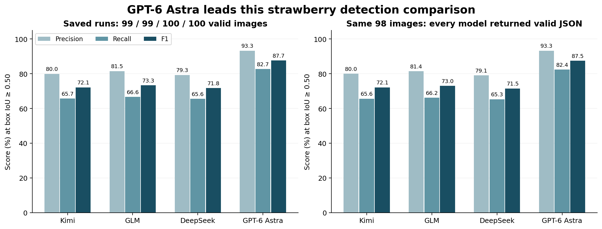
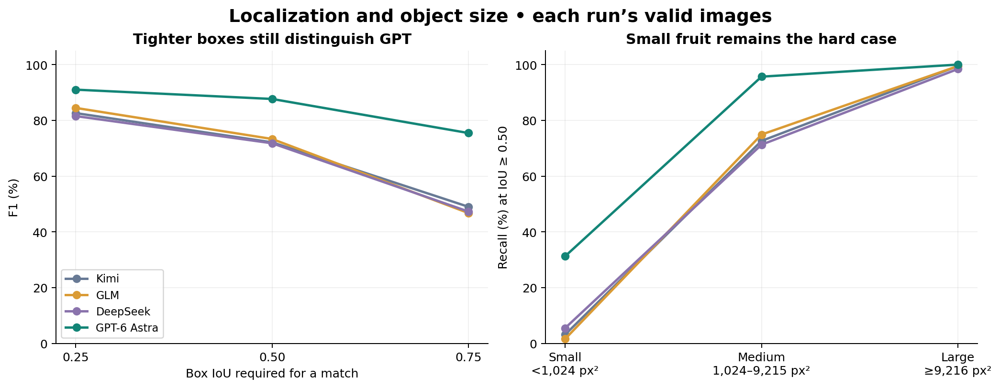
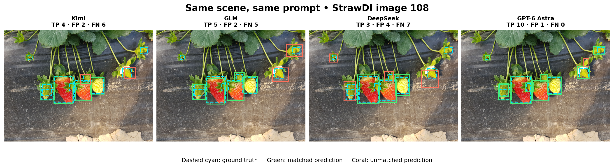
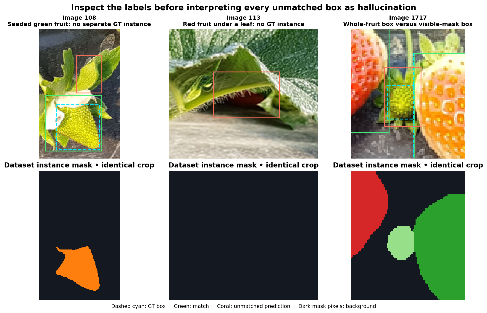
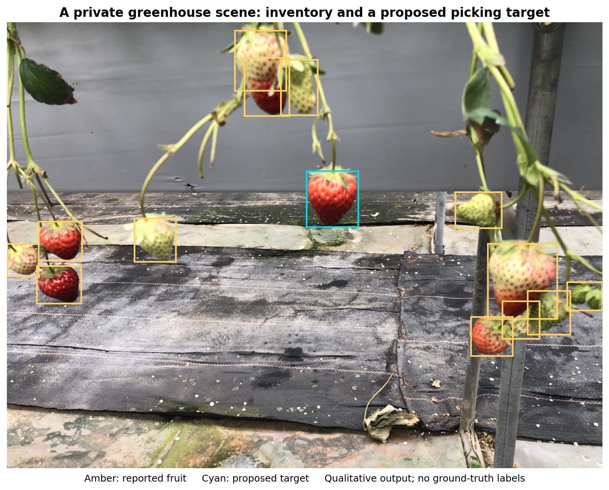
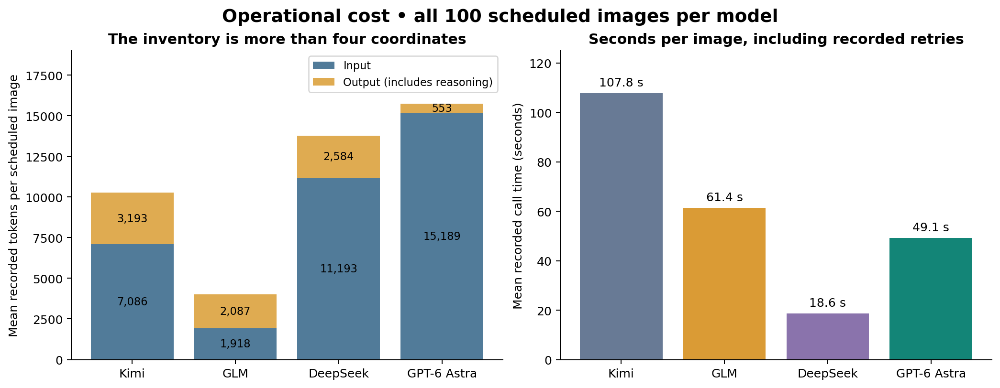

# Is Visual Fruit Detection Solved by Vision-Language Models, and What Remains? — In the GPT-6 Astra Era and Beyond

Sep 15, 2026

Detecting fruit in images has been a long-standing challenge in agricultural computer vision. It is hard not because we cannot achieve high accuracy on a specific dataset, but because real-world scenarios are highly variable. No two orchards look the same, and the same type of fruit can look very different depending on the environment (weather, lighting, occlusion, etc.) and the fruit itself (variety and horticultural practices). Most deep learning-based fruit detection methods rely on large amounts of labelled data to cover the variability (distribution) in the real world. Detection in out-of-distribution (OOD) scenarios often fails. Unfortunately, due to the inherent variability of real-world conditions and data privacy issues, fruit detection always has to deal with OOD scenarios. This means that one often cannot deploy a model trained in one orchard directly to another orchard without fine-tuning it with new data.

My collaborators and I have been working on improving the generalizability of fruit detection models for a while and have tried many methods, including domain adaptation, GANs (generative adversarial networks) [1], and learning from foundation models [2,3]. These methods have shown improvements, but they are still far from solving the problem.

In the meantime, I have always paid attention to vision-language models (VLMs), which are pre-trained on large-scale image–text pairs and have shown impressive generalization ability across many vision tasks. I have been wondering whether VLMs can help with fruit detection and have kept testing them on fruit detection tasks. However, the results were not promising, especially for precise detection.

General-purpose vision-language models have shown impressive visual recognition and reasoning abilities, including the ability to identify fruits across diverse scenes without task-specific training. However, their performance on precise detection has historically been less reliable, as we can see in the experiments below. Several factors may have contributed to this gap. First, there has often been a training-objective mismatch: many VLMs were trained primarily for image–text alignment, captioning, visual question answering, and instruction following rather than exhaustive instance-level localization [4]. Second, strong semantic representations do not necessarily imply equally precise spatial representations; a model may understand what objects are present without representing where every instance is with the same accuracy [4,5]. Third, visual resolution and tokenization may limit small and dense object perception, particularly when many similar objects occupy only a small number of visual tokens [6]. These should be viewed as characteristics of earlier and current VLM designs rather than fundamental limitations, as newer multimodal models such as GPT-6 Astra may substantially change this trade-off.

What motivated me to re-evaluate VLMs for fruit detection was the release of GPT-6 Astra. I had seen surprisingly strong results from Astra on tasks that appear to require substantial visual grounding and spatial understanding—for example, reconstructing and creating complex 3D scenes using tools such as Blender [7], and directly controlling robotic manipulators without task-specific policy training [8,9]. In one recent evaluation, Astra, used directly as a robot policy, even exceeded the reported performance of a specialized VLA baseline [8]. Astra has also set new highs on several visual-spatial and 3D reconstruction evaluations [7]. These results made me wonder whether the capabilities of general-purpose VLMs had reached a point where they could also achieve state-of-the-art performance on fruit detection—or, more broadly, on conventional visual detection tasks.

In this blog, I will share my experience using GPT-6 Astra and other VLMs for fruit detection, examine what has changed compared with earlier generations of VLMs, and explain why the results surprised me so much.

[#	Reference
[1]	Fei, Z., Olenskyj, A. G., Bailey, B. N., & Earles, M. (2021). Enlisting 3D crop models and GANs for more data-efficient and generalizable fruit detection. Proceedings of the IEEE/CVF International Conference on Computer Vision (ICCV), 1269–1277.
[2]	Wang, Y., Fei, Z., Li, R., & Ying, Y. (2025). Learn from foundation model: Fruit detection model without manual annotation. Pattern Recognition, 112799.
[3]	Wang, Y., Li, W., Ying, Y., & Fei, Z. (2026). GEAR-Seg: A Grounded Explainable Agent for Reasoning Segmentation and Data Engine. arXiv preprint arXiv:2607.00544.
[4]	Ranasinghe et al. (2024). Learning to Localize Objects Improves Spatial Reasoning in Visual-LLMs. CVPR 2024.
[5]	Schaumloffel et al. (2026). Mechanisms of Object Localization in Vision-Language Models. CVPR 2026.
[6]	SOUBench: Benchmarking Small-Object Understanding in Multimodal Large Language Models. 2026.
[7]	OpenAI. (2026). GPT-6 Astra: The Next Generation in Intelligence for Work. https://openai.com/index/gpt-6-astra-next-generation-work/
[8]	Su et al. (2026). GPT-6 Astra as an Embodied Policy. https://anonymous-report-421.github.io/public-website/?lang=en&view=1
[9]	Robocurve. (2026). GPT-6 Astra on Robotic Manipulation. https://openai.robocurve.org/gpt-6-astra/]

## A common experiment on StrawDI

### What is StrawDI?

The **Strawberry Digital Images dataset**, or StrawDI, contains photographs collected at commercial plantations in Huelva, Spain. Its annotated subset, **StrawDI_Db1**, contains 3,100 images at 1008 × 756 pixels, split into 2,800 training, 100 validation, and 200 test images. Each strawberry has an instance mask: a set of pixels identifying that individual fruit. The annotation policy includes unripe, occluded, distant, and partly cropped fruit. [Official dataset description][strawdi]

We evaluated **all 100 validation images**, containing **572 annotated strawberries**. We converted each instance mask into its tight bounding box and retained every instance, including very small ones. No model was trained or fine-tuned on StrawDI as part of this experiment. This is a zero-shot evaluation in that operational sense; because StrawDI is public, it does not establish that the images were absent from model pretraining.

### The task and the controls

Every model received the same image and the same prompt, asking for a complete inventory of strawberries regardless of colour, size, or occlusion. Each fruit required eight fields: its bounding box, redness, occlusion, calyx visibility, stem visibility, apparent graspability, confidence, and a description.**Only the bounding boxes were evaluated against ground truth.** The other attributes have no labels in this benchmark. The detection prompt did not request a picking point or nominate a target.

The models saw the original, unannotated images at their stored resolution. Each batch began with a synthetic visual control to verify image delivery. Tools and file access were disabled, and no detector, segmenter, or tracker assisted the model. All four detection runs passed validation checks, including reconstruction of ground-truth boxes from the original masks. We also checked that the saved prompts were identical and re-scored every valid response.

| Display name | Recorded model identifier | CLI used | Reasoning effort |
| --- | --- | --- | --- |
| Kimi | `kimi-for-coding` | Codex | Provider default |
| GLM | `glm-5.3-flash` | Claude | Provider default |
| DeepSeek | `deepseek-flash` | Codex | High |
| GPT-6 Astra | `gpt-6-astra` | Codex | Low |

*Model identities and routing were recorded during inference.*

This is a comparison of **these configurations under a common detection task**. Reasoning effort, provider routing, and harness versions differ, so it is not a controlled experiment isolating model architecture. We did not run a matched compute-budget comparison.

### The exact detection prompt

The following prompt was identical across all four models and all 100 StrawDI images. Each request included one unannotated image. We reproduce the wording verbatim, including the whole-fruit box definition discussed later. The separate qualitative greenhouse experiment used a different prompt that also requested picking points and a target nomination.

```text
You are looking at ONE image: a 1008x756 colour photograph of a strawberry plant.

COORDINATE SYSTEM for every coordinate you report: pixel coordinates, origin (0, 0) at the TOP-LEFT corner of the image, x increasing to the RIGHT (valid 0..1007), y increasing DOWNWARD (valid 0..755). Report whole numbers of pixels.

TASK
Produce a complete inventory of the strawberries in this image. For each one, describe it fully:
- "bbox": [x1, y1, x2, y2] - the bounding box of the WHOLE fruit. For a partly hidden fruit, give the box the fruit would occupy if the occluder were not there, not just the visible sliver. Box ONLY the fruit body: do not extend the box to cover the calyx (the green sepal leaves) or the stem when they sit apart from the fruit - a calyx that lies flat against the fruit is of course inside the box.
- "redness_pct": 0-100, a CONTINUOUS estimate - do not round to a category. Percent of the fruit's VISIBLE surface that is red, judged by hue and saturation together: 0 = no red at all (green or white), 25 = a pale pink flush, 50 = about half the visible surface is red, 75 = mostly red with pale or green patches left, 100 = fully saturated deep red everywhere. Use the whole range; 63 is a better answer than 60.
- "occlusion_pct": 0-100, also CONTINUOUS. How much of the fruit is hidden behind leaves, stems or other fruit: 0 = fully visible, 25 = a leaf edge clips it, 50 = about half hidden, 75 = mostly hidden, 100 = only a sliver shows.
- "calyx_visible": true if the green calyx (sepal ring) can be seen.
- "peduncle_visible": true if the stem is visible where it meets the fruit.
- "graspable": true if a gripper could pick this fruit right now, judging only from what is visible.
- "confidence_pct": 0-100. How sure you are that this really is a strawberry.
- "description": one or two sentences of plain language describing this fruit: its colour and colour pattern, what is occluding it and where, how big it looks, where it sits on the plant, and anything else a picker would want to know. This is free text - write what you actually see, not a restatement of the numbers.

Report EVERY strawberry you can see, whatever its colour. This is an inventory, not a picking decision: do NOT filter by ripeness and do NOT omit a fruit just because it is green, small, or partly hidden. Partly occluded fruit matters as much as fully visible fruit - include a fruit if you can see any part of it, and say how much is hidden in occlusion_pct. Order the list from largest to smallest apparent size. Do not invent fruit that is not there.

Do not label fruit as 'ripe' or 'unripe' - report the continuous redness and occlusion numbers and describe the fruit in words instead.

Each strawberry must carry EXACTLY the eight fields listed above - no more, no fewer, none renamed. If you have nothing for a field, still include it. Put any extra remarks inside description rather than adding a field.

Reply with ONLY a JSON object and nothing else - no prose, no code fences:
{"strawberries": [{"bbox": [x1, y1, x2, y2], "redness_pct": 0, "occlusion_pct": 0, "calyx_visible": true, "peduncle_visible": true, "graspable": true, "confidence_pct": 0, "description": "..."}, ...]}

Answer only from the image you were given. You have no tools, no shell and no file access for this task, so do not attempt to read any file, and do not emit tool calls.
```

### What do the metrics mean?

**Intersection over Union (IoU)** measures box overlap: the area shared by the predicted and labelled boxes divided by the area covered by either. At IoU ≥ 0.50, a prediction must overlap a labelled fruit sufficiently to count as a true positive. Predictions are processed in descending confidence order, and each ground-truth fruit can be matched only once. Unmatched predictions are false positives; unmatched labels are false negatives.

- **Precision** = TP / (TP + FP): how many reported detections match labels?
- **Recall** = TP / (TP + FN): how many labelled fruits were found?
- **F1** = 2PR / (P + R): a balance between precision and recall.
- **AP50** summarizes the precision–recall curve at IoU 0.50.**mAP50–95** averages AP across IoU thresholds from 0.50 to 0.95 in steps of 0.05.
- **Count MAE** is the mean absolute difference between predicted and labelled fruit counts per image. It measures inventory error, not localization quality.

Our scorer’s AP uses all-points interpolation. It is not the complete COCO evaluation protocol, which samples precision at 101 recall thresholds. [Official COCO evaluator](https://github.com/cocodataset/cocoapi/blob/master/PythonAPI/pycocotools/cocoeval.py) F1 is our primary metric; AP is secondary because the VLMs’ reported confidence values often cluster near the top of the range, making ranking sensitive to ties. All headline precision, recall, and F1 values pool detections across the valid images.

## Results: a clear improvement, with a clear boundary

| Model | Valid images / scheduled | Precision @50 | Recall @50 | F1 @50 | AP50 | mAP50–95 | Count MAE |
| --- | ---: | ---: | ---: | ---: | ---: | ---: | ---: |
| Kimi | 99 / 100 | 80.0% | 65.7% | 72.1% | 62.8% | 37.7% | 1.14 |
| GLM | 99 / 100 | 81.5% | 66.6% | 73.3% | 65.3% | 35.2% | 1.12 |
| DeepSeek | 100 / 100 | 79.3% | 65.6% | 71.8% | 62.2% | 34.5% | 1.09 |
| **GPT-6 Astra** | **100 / 100, after retries** | **93.3%** | **82.7%** | **87.7%** | **82.5%** | **60.5%** | **0.77** |

*Metrics use each run’s valid responses. Kimi and GLM exclude different failed images, leaving 565 and 563 labelled instances respectively; DeepSeek and GPT include all 572.*

GPT’s improvement is visible in both precision and recall. It matches **473 of 572 labelled fruits**, with **34 unmatched predictions** and **99 missed labels**. Its F1 exceeds the next-highest result, GLM, by **14.4 percentage points**. These are encouraging detection results, although they leave meaningful room for improvement.



*Figure 1. Left: each run’s valid images. Right: the same 98 images with valid responses from every model. GPT’s lead persists when the evaluated images are identical.*

On that common subset, F1 is **72.1% for Kimi, 73.0% for GLM, 71.5% for DeepSeek, and 87.5% for GPT**. Thus, the different exclusions do not explain the ranking. This comparison still includes GPT’s recovered responses; it measures detection quality after recovery, not first-pass reliability.

**The retry qualification matters.** GPT initially returned valid answers for 82 images. The original failures were 16 empty CLI responses and two malformed JSON replies. A separately requested retry recovered all 18, and the consolidated run retains both attempts. Its final detection score therefore comes from 118 detection calls, with successful visual controls for both batches. The original 82 valid responses had F1 87.3%, but that conditional score says nothing about the unreturned answers. GLM also used automatic retries: four of five retried images recovered, leaving one invalid response. Kimi had one invalid response and no recorded retry; DeepSeek returned valid responses for every image without retries.

### Precise localization improves; tiny fruit remains difficult

At the stricter IoU threshold of 0.75, GPT retains **75.4% F1**, compared with **46.7–49.0%** for the other models. Its advantage therefore extends to tighter localization. Size-stratified recall exposes the remaining weakness: GPT finds **190/190 large**, **243/254 medium**, and **40/128 small** labelled instances. The strata use visible mask area: small is below 1,024 pixels², medium is 1,024–9,215 pixels², and large is at least 9,216 pixels².



*Figure 2. Each model’s valid images are used. GPT remains stronger as localization requirements tighten, but its small-instance recall is only 31.3%.*

Those small instances account for **88 of GPT’s 99 missed labels**. This is why I would not call complete fruit inventory solved: a model can localize prominent fruit very well while still missing much of the smallest visible fruit.

### What the difference looks like



*Figure 3. StrawDI image 108, selected to illustrate overlapping fruit and different sizes. Dashed cyan boxes are ground truth; green boxes are matched predictions; coral boxes are unmatched predictions at IoU 0.50. GPT matches all ten labelled instances in this image and reports an additional green fruit examined below. This is an illustrative example, not a representative sample estimate.*

### How does this relate to the StrawDI paper?

The original paper evaluates **instance segmentation on the 200-image test set**. It compares Mask R-CNN with a faster architecture derived from it. The authors report the following headline results; these are literature reference points, not baselines rerun in our experiment. [Pérez-Borrero et al., 2020][paper]

| Method in the original paper | Mean segmentation AP | Mean instance IoU, I²oU | Reported speed |
| --- | ---: | ---: | ---: |
| Original Mask R-CNN | 45.36 | 87.70 | 5 frames/s |
| Authors’ proposed method | 43.85 | 87.27 | 10 frames/s |

*Source: the [paper’s abstract and experimental description][paper]; experiments used a GTX 1080 Ti GPU.*

Our box mAP of 60.5% cannot establish superiority over those segmentation AP values. The output representation, split, and evaluation protocol differ. A direct claim would require the methods to be evaluated on the same images with the same task and scorer. These results establish GPT’s lead among the VLM configurations tested here; they do not establish a new state of the art against specialist detectors. [Original paper][paper]

## Some apparent errors are annotation disagreements

An unmatched prediction does not tell us *why* the prediction failed. It may be an invented object, an inaccurate box, a disagreement about the fruit’s hidden extent, or a visible fruit missing from the labels. The following crops distinguish two likely annotation omissions from a box-definition mismatch. They were inspected against the original image and instance mask; the published scores remain unchanged.



*Figure 4. Top: original pixels with saved boxes. Bottom: the corresponding instance masks, with background shown in dark grey. Left, image 108: a seeded green fruit has no separate mask. Centre, image 113: a red fruit beneath a leaf is unlabelled. Right, image 1717: a labelled green fruit’s visible surface occupies less area than GPT’s predicted whole-fruit box. These are visual interpretations of selected cases.*

In **image 108**, the additional detection covers a visible green, seed-textured fruit above the petal-covered fruit. In **image 113**, it covers the exposed red surface beneath a leaf. The corresponding mask regions contain no labelled instance. These are persuasive candidates for annotation omissions, rather than obvious hallucinations. They warrant review by the dataset annotators.

**Image 1717 illustrates a different issue.** Our prompt asks for the *whole fruit*, including hidden portions, whereas the ground-truth box encloses the *visible mask*. A reasonable completion of an occluded fruit can therefore lose IoU. This mismatch is part of the experiment’s design and should be corrected in a future benchmark with aligned box definitions; it is not automatically a dataset error.

The aggregate diagnostics are consistent with an occlusion penalty: GPT’s mean matched IoU is about **0.90** for predictions reporting less than 25% occlusion, versus **0.73** for those reporting at least 25%. But the occlusion estimates come from GPT itself, and this comparison includes only matched predictions. It does not measure how much of the total error is caused by annotations.

Consequently, I would not claim that **most** of the remaining error is ground-truth error. The visual evidence supports a more precise conclusion: **some scored false positives appear to be real fruit, and the prompt’s box definition can penalize sensible predictions on occluded fruit**. A blind audit of all unmatched predictions and missed labels would be needed to estimate their contribution. Until then, the original labels and unadjusted scores are the appropriate reference.

## The ability of VLMs beyond detection

What interests me most is the information attached to a detected object. In our separate greenhouse experiment, GPT describes colour patterns, overlapping leaves, visible stems, and the apparent accessibility of individual fruit. It can then nominate a picking target while keeping the full inventory separate from that decision. These are observed outputs from our experiment, not independently validated horticultural or grasping judgments.



*Figure 5. Qualitative output on a scene collected by our team. Amber outlines indicate reported fruit; cyan highlights the proposed picking target. The model was asked to describe every visible strawberry and then propose a picking target.*

For the central red fruit, the model describes exposed stem access and space around the fruit as reasons to prefer it. For a partly concealed fruit higher in the image, it describes the hidden upper surface and reports no usable picking point. For the larger pale fruit on the right, it describes the transition from a creamy upper surface to a red tip. The useful feature is the connection between an object, its appearance, and a proposed action.

This suggests a flexible interface for agricultural perception. An inventory can support counting; a colour description can support a user-defined classification rule; and a description of occlusion can guide which fruit an operator inspects next. These are potential uses of the demonstrated output structure, rather than additional tasks benchmarked here. Changing the question is straightforward, but the resulting answers still need task-specific validation.

These images come from our own collection and were not publicly released before this evaluation. That makes them a useful check beyond the public benchmark. However, private collection alone cannot prove absence from every possible training source, nor does it establish that the visual conditions lie outside the model’s training distribution. I interpret the results as qualitative evidence of transfer to our deployment setting. The frames have no ground-truth annotations, so they do not establish detection or picking accuracy.

## Current limitations of using VLMs as detection models and future directions

### Latency is still far from a real-time detector

The recorded mean call time per scheduled image is approximately **108 seconds for Kimi, 61 seconds for GLM, 19 seconds for DeepSeek, and 49 seconds for GPT**. These averages include recorded retries and CLI overhead. They are sums of per-image call durations divided by the number of scheduled images, not total batch duration divided by that number; concurrent requests can improve throughput without reducing individual latency.

For scale, Ultralytics reports **1.5–11.3 milliseconds** for YOLO11 detection models on a T4 GPU with TensorRT at 640-pixel input size. These are different hardware, resolutions, and workloads, so the numbers are not a controlled speed comparison. They nevertheless illustrate the gap between a local detector and the remote inventory calls measured here. [Official YOLO11 benchmarks](https://docs.ultralytics.com/models/yolo11/)



*Figure 6. Means across all scheduled images, including recorded retry usage and time. Input includes cached input where reported; output includes reported reasoning tokens, which are not added again. Token accounting and CLI overhead differ across providers, so these are operational measurements of the configurations used. Control calls are excluded.*

### The cost depends on the entire request

GPT averaged **15,189 recorded input tokens and 553 output tokens per scheduled image**, including retained retry usage. Those inputs include the delivered image and harness context, not just the short detection instruction. OpenAI’s listed standard rates are **$10 per million input tokens, $1 per million cached input tokens, and $50 per million output tokens**, checked on September 15, 2026. [Official GPT-6 Astra pricing][pricing]

At those rates, treating all input as uncached gives an estimate of **$0.180 per image**, or **$18.0 per 100 images**. Applying the recorded cache-read counts gives approximately **$0.078 per image**, or **$7.84 per 100**. These estimates exclude controls, separately billed cache writes, and any usage absent from the logs; they are not an invoice. The formula is `(uncached input × input rate + cached input × cached rate + output × output rate) / 1,000,000`. [Pricing terms][pricing]

For an occasional scene audit, that may be acceptable. For continuous video, I would first investigate reducing request frequency, simplifying the output, or transferring the capability to a local model. Those are deployment choices to test, not cost reductions established by this experiment.

### Edge deployment needs its own evaluation

We have not demonstrated GPT-quality detection on an edge device. A worthwhile next experiment is to test locally runnable VLMs, including **Qwen3.8-27B** and smaller vision-capable Qwen variants, under the same detection protocol. The official Qwen repository documents released weights and local serving options; that establishes candidates for testing, not their fitness for a resource-constrained robot. [Official Qwen model and deployment documentation](https://github.com/QwenLM/Qwen3.8/blob/main/README.md)

I would measure memory use, power, latency, and localization after quantization on the intended hardware. A model that fits in memory still has to deliver useful answers within the robot’s operating budget.

### Where I would take this next

My next experiments would address three questions:

1.**How much capability survives local deployment?** Compare edge candidates on the same images, with aligned visible-surface box definitions and a uniform retry budget.
2.**Which richer outputs are actually useful?** Validate descriptions, condition estimates, and picking proposals against expert judgments and robot outcomes.
3.**Can a stronger VLM teach a smaller model?** Use its predictions and explanations as candidate training annotations, review uncertain cases, and evaluate the resulting student on separately held-out farms. This is a proposed direction, not a demonstrated distillation result.

These priorities follow directly from the measured small-fruit failures, latency, annotation disagreements, and unvalidated attributes in the present experiment.

## What “solved” would mean to me

The strongest result here is that a general-purpose VLM, given raw pixels and a common written instruction, can produce a useful strawberry inventory with substantially better localization than the other VLM configurations we tested. The gains survive a comparison on identical images and stricter overlap requirements.

That changes how I would begin a new fruit-perception project: I would test a strong VLM early, before assuming that a new collection-and-training cycle is necessary. But I would still measure small-object recall, reliability, speed, and performance in the actual deployment setting.

**Fruit detection is not universally solved. What has changed is how capable the starting point can be.**

---

### Experiment notes

The figures and tables were compiled from saved model responses; preparing this article made no additional model calls. Every valid detection response was re-scored, and the common-subset comparison uses identical images, prompts, and ground-truth boxes. Failures remain explicitly reported. The example images were selected to explain specific behaviours and should not be read as an unbiased visual sample. No labels were edited to improve the reported scores.

This is an exploratory evaluation on one validation split, with one completed response per image after the retries described above. It does not quantify run-to-run variability or performance across independent farms. A broader, held-out evaluation with uniform inference settings is the next step.

**Dataset acknowledgement:** Kindly provided by the StrawDI Team (see [the official dataset website][strawdi]).

**Dataset paper:** Isaac Pérez-Borrero, Diego Marín-Santos, Manuel E. Gegúndez-Arias, and Estefanía Cortés-Ancos. “A fast and accurate deep learning method for strawberry instance segmentation.” *Computers and Electronics in Agriculture* 178 (2020), 105736. [doi:10.1016/j.compag.2020.105736][paper]

[strawdi]: https://strawdi.github.io/
[paper]: https://www.sciencedirect.com/science/article/pii/S0168169920300624
[pricing]: https://developers.openai.com/api/docs/models/gpt-6-astra
