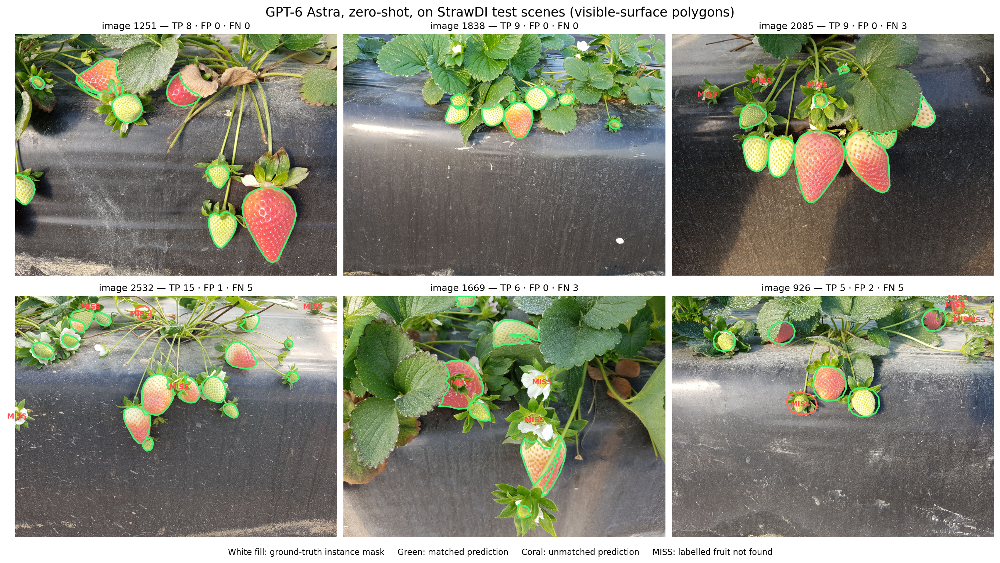
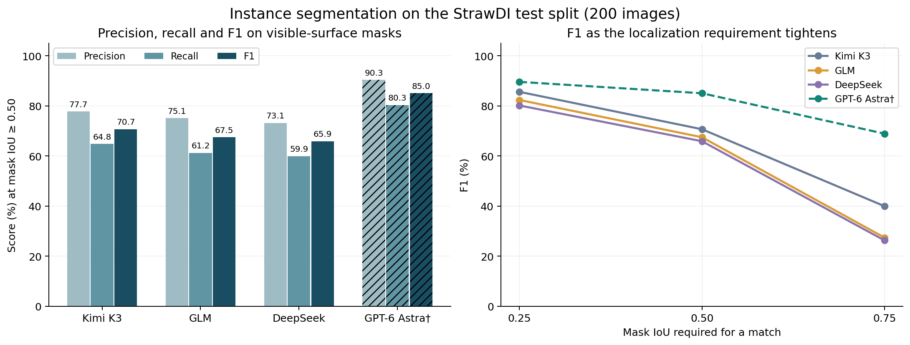
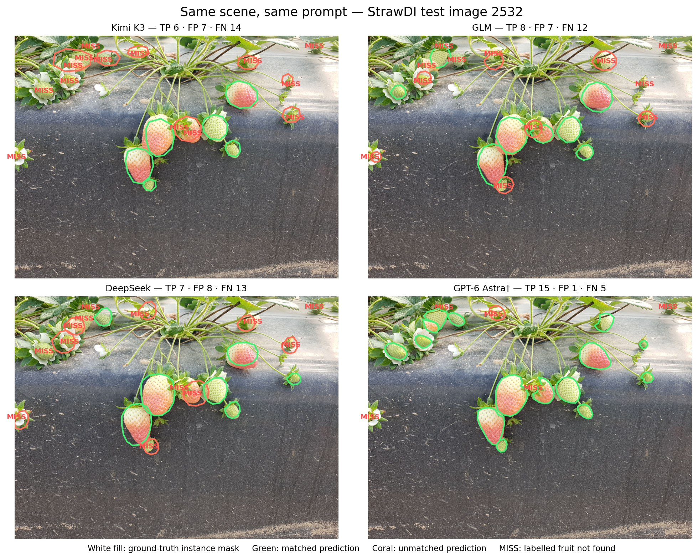
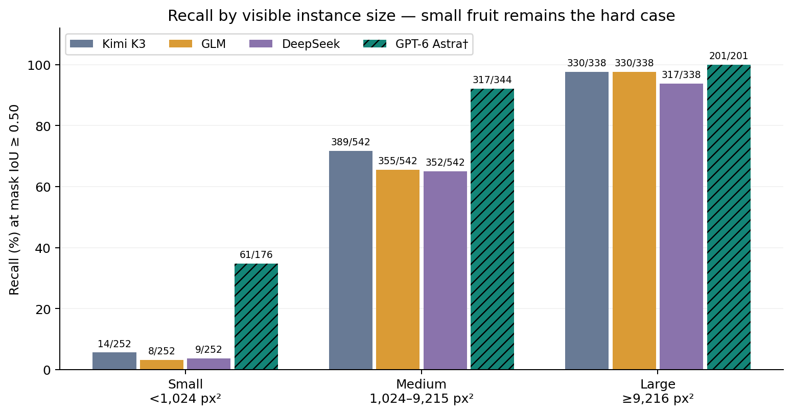
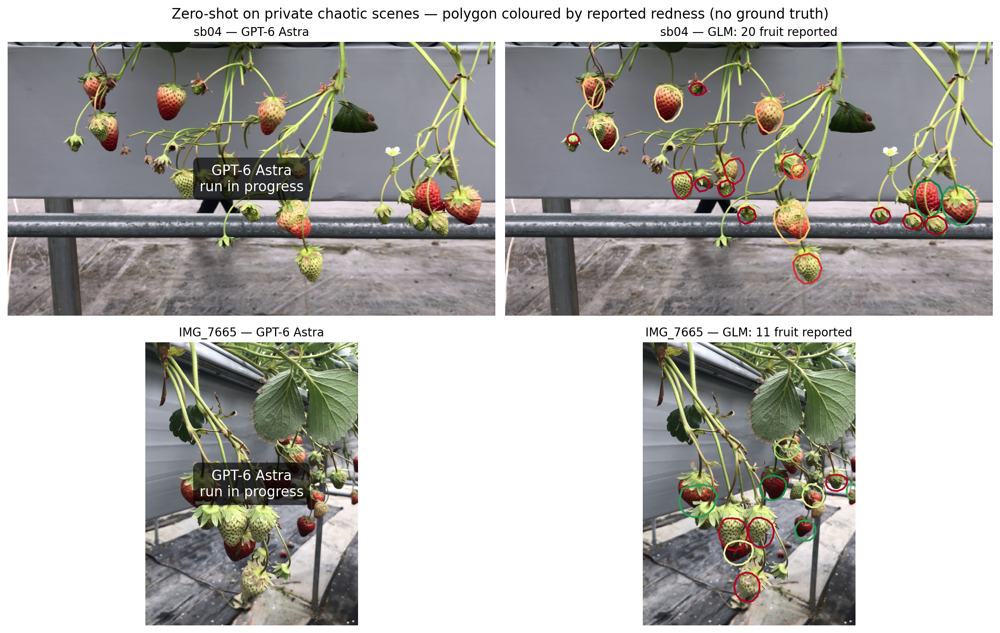
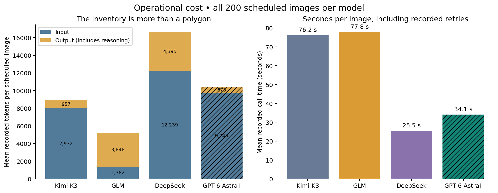

# Is Visual Fruit Detection Solved by Vision-Language Models, and What Remains? — In the GPT-6 Astra Era and Beyond

Sep 16, 2026 Zhenghao Fei [email](mailto:fei.holly@gmail.com)

Detecting fruit in images has been a long-standing challenge in agricultural computer vision. It is hard not because we cannot achieve high accuracy on a specific dataset, but because real-world scenarios are highly variable. No two orchards look the same, and the same type of fruit can look very different depending on the environment (weather, lighting, occlusion, etc.) and the fruit itself (variety and horticultural practices). Most deep learning-based fruit detection methods rely on large amounts of labelled data to cover the variability (distribution) in the real world. Detection in out-of-distribution (OOD) scenarios often fails. Unfortunately, due to the inherent variability of real-world conditions and data privacy issues, fruit detection always has to deal with OOD scenarios. This means that one often cannot deploy a model trained in one orchard directly to another orchard without fine-tuning it with new data.

My collaborators and I have been working on improving the generalizability of fruit detection models for a while and have tried many methods, including domain adaptation, GANs (generative adversarial networks) [1], and learning from foundation models [2,3]. These methods have shown improvements, but they are still far from solving the problem.

In the meantime, I have always paid attention to vision-language models (VLMs), which are pre-trained on large-scale image–text pairs and have shown impressive generalization ability across many vision tasks. I have been wondering whether VLMs can help with fruit detection and have kept testing them on fruit detection tasks. However, the results were not promising, especially for precise detection.

General-purpose vision-language models have shown impressive visual recognition and reasoning abilities, including the ability to identify fruits across diverse scenes without task-specific training. However, their performance on precise detection has historically been less reliable, as we can see in the experiments below. Several factors may have contributed to this gap. First, there has often been a training-objective mismatch: many VLMs were trained primarily for image–text alignment, captioning, visual question answering, and instruction following rather than exhaustive instance-level localization [4]. Second, strong semantic representations do not necessarily imply equally precise spatial representations; a model may understand what objects are present without representing where every instance is with the same accuracy [4,5]. Third, visual resolution and tokenization may limit small and dense object perception, particularly when many similar objects occupy only a small number of visual tokens [6]. These should be viewed as characteristics of earlier and current VLM designs rather than fundamental limitations, as newer multimodal models such as GPT-6 Astra may substantially change this trade-off.

What motivated me to re-evaluate VLMs for fruit detection was the release of GPT-6 Astra. I had seen surprisingly strong results from Astra on tasks that appear to require substantial visual grounding and spatial understanding—for example, reconstructing and creating complex 3D scenes using tools such as Blender [7], and directly controlling robotic manipulators without task-specific policy training [8,9]. In one recent evaluation, Astra, used directly as a robot policy, even exceeded the reported performance of a specialized VLA baseline [8]. Astra has also set new highs on several visual-spatial and 3D reconstruction evaluations [7]. These results made me wonder whether the capabilities of general-purpose VLMs had reached a point where they could also achieve state-of-the-art performance on fruit detection—or, more broadly, on conventional visual detection tasks.

In this blog, I will share my experience using GPT-6 Astra and other VLMs for fruit detection, examine what has changed compared with earlier generations of VLMs, and explain why the results surprised me so much.

[#	Reference
[1]	Fei, Z., Olenskyj, A. G., Bailey, B. N., & Earles, M. (2021). Enlisting 3D crop models and GANs for more data-efficient and generalizable fruit detection. Proceedings of the IEEE/CVF International Conference on Computer Vision (ICCV), 1269–1277.
[2]	Wang, Y., Fei, Z., Li, R., & Ying, Y. (2025). Learn from foundation model: Fruit detection model without manual annotation. Pattern Recognition, 112799.
[3]	Wang, Y., Li, W., Ying, Y., & Fei, Z. (2026). GEAR-Seg: A Grounded Explainable Agent for Reasoning Segmentation and Data Engine. arXiv preprint arXiv:2607.00544.
[4]	Ranasinghe et al. (2024). Learning to Localize Objects Improves Spatial Reasoning in Visual-LLMs. CVPR 2024.
[5]	Schaumloffel et al. (2026). Mechanisms of Object Localization in Vision-Language Models. CVPR 2026.
[6]	SOUBench: Benchmarking Small-Object Understanding in Multimodal Large Language Models. 2026.
[7]	OpenAI. (2026). GPT-6 Astra: The Next Generation in Intelligence for Work. https://openai.com/index/gpt-6-astra-next-generation-work/
[8]	Su et al. (2026). GPT-6 Astra as an Embodied Policy. https://anonymous-report-421.github.io/public-website/?lang=en&view=1
[9]	Robocurve. (2026). GPT-6 Astra on Robotic Manipulation. https://openai.robocurve.org/gpt-6-astra/]

I am particularly impressed by three aspects of what VLMs may offer from this point forward.

1. **Accuracy.**
   Accuracy is the most fundamental metric for visual detection, and GPT-6 Astra shows a substantial improvement over previous VLMs. In our experiments, it detected strawberries with very high precision, even in challenging scenarios involving occlusion, dense clusters, and large variations in fruit size. More interestingly, when we examined the apparent “errors” carefully, many of them turned out to be annotation disagreements rather than clear model failures. In other words, Astra appears to be approaching ground-truth-level detection accuracy in some of our test cases.

2. **Zero-shot generalization.**
   All of our detection experiments were conducted in a zero-shot setting: the model was neither trained nor fine-tuned on the evaluation dataset. Despite this, GPT-6 Astra was able to detect strawberries accurately across diverse scenes. This level of generalization could fundamentally change how fruit detection systems are developed. Instead of collecting and labeling a large dataset for every new orchard, crop variety, camera setup, or environment, users may be able to apply a general-purpose VLM directly to a new detection task with little or no task-specific training.

3. **Near-infinite flexibility.**
   GPT-6 Astra is not limited to returning a bounding box and class label. For each detected fruit, it can also provide a pixel-level outline of the fruit's visible surface and rich semantic information, such as redness, occlusion, calyx visibility, stem visibility, graspability, confidence, and a natural-language description. The output can also be changed simply by modifying the prompt. This makes the detector highly flexible: users can request new attributes, redefine what counts as a target, or adapt the output to different downstream tasks without retraining the model. In this sense, the system begins to look less like a fixed-purpose detector and more like a general visual perception interface.

## A common experiment on StrawDI

The **Strawberry Digital Images dataset (StrawDI)** contains photographs collected at commercial plantations in Huelva, Spain. Its annotated subset, **StrawDI_Db1**, contains 3,100 images at 1008 × 756 pixels, split into 2,800 training, 100 validation, and 200 test images, with an instance mask for every strawberry — including unripe, occluded, distant, and partly cropped fruit. [Official dataset description][strawdi]

We evaluated **all 200 test images (1,132 annotated strawberries)** — the same split the dataset's own paper benchmarks on, so our numbers can be set next to its supervised specialist directly. No model was trained or fine-tuned on StrawDI: this is a zero-shot evaluation in the operational sense. Because StrawDI is public, it does not establish that the images were absent from model pretraining.

### The task and the controls

Every model received the same unannotated image and the same prompt: a complete inventory of the strawberries, with nine fields per fruit — bounding box, a polygon outlining the fruit's **visible surface**, redness, occlusion, calyx visibility, stem visibility, graspability, confidence, and a free-text description. **The polygons were scored as instance segmentation directly against the raw ground-truth masks** — the StrawDI paper's own benchmark task — and the boxes from the same responses were scored as detection as a cross-check. The other attributes have no labels in this benchmark.

We report the segmentation experiment as *the* result, not as a second stage after detection, for a principled reason: the masks annotate each fruit's visible surface, the polygon asks for exactly the same thing, so mask-versus-mask comparison carries no definition gap. (The box definition does have one — the prompt asks for the *whole* fruit while the label covers only the *visible* part — which is why the boxes are demoted to a cross-check here.)

The controls: a synthetic visual check at the start of each batch verified image delivery; tools and file access were disabled; no detector, segmenter, or tracker assisted the model; ground truth was read only after the call and recomputed from the original masks; and every valid response was re-scored from the saved prompts. All runs passed validation.

| Display name | Recorded model identifier | CLI used | Reasoning effort |
| --- | --- | --- | --- |
| Kimi K3 | `k3-256k` | Codex | Provider default |
| GLM | `glm-5.3-flash` | Claude | Provider default |
| DeepSeek | `deepseek-flash` | Codex | Provider default |
| GPT-6 Astra † | `gpt-6-astra` | Codex | Low |

*Model identities and routing were recorded during inference. † The GPT-6 Astra test batch is still completing at the time of writing — 125 of 200 images have valid responses so far — and its numbers here are pooled over that completed subset; they will be replaced with the full 200-image results without any other change to this article.* <!-- PENDING-GPT-TEST: replace GPT rows/numbers and drop this note once the full+retry merge covers 200/200; then set GPT_PENDING=False in blogs/build_fruit_detection_figures.py and rerun it. -->

Reasoning effort, provider routing, and harness versions differ across these configurations, so this is a comparison of **configurations under a common task**, not a controlled experiment isolating model architecture.

### The exact prompt

The following prompt was identical across all four models and all 200 StrawDI test images; we reproduce it verbatim, including the whole-fruit box definition and the visible-surface polygon definition discussed above.

```text
You are looking at ONE image: a 1008x756 colour photograph of a strawberry plant.

COORDINATE SYSTEM for every coordinate you report: pixel coordinates, origin (0, 0) at the TOP-LEFT corner of the image, x increasing to the RIGHT (valid 0..1007), y increasing DOWNWARD (valid 0..755). Report whole numbers of pixels.

TASK
Produce a complete inventory of the strawberries in this image. For each one, describe it fully and trace the outline of its visible surface:
- "bbox": [x1, y1, x2, y2] - the bounding box of the WHOLE fruit. For a partly hidden fruit, give the box the fruit would occupy if the occluder were not there, not just the visible sliver. Box ONLY the fruit body: do not extend the box to cover the calyx (the green sepal leaves) or the stem when they sit apart from the fruit - a calyx that lies flat against the fruit is of course inside the box.
- "polygon": an ordered list of [x, y] vertices tracing the outline of the fruit's VISIBLE surface - the part you can actually see. Walk the boundary once, clockwise or counter-clockwise, starting anywhere. Where a leaf, stem or another fruit hides part of this fruit, follow the occluder's edge; do NOT extrapolate the shape you cannot see (unlike bbox, polygon covers ONLY what is visible). Same fruit-body rule as bbox: exclude the calyx and stem where they sit apart from the fruit. Use 8 to 20 vertices for a typical fruit and never more than 32; a simple closed outline (no self-crossing, no repeated closing vertex) drawn with straight segments between vertices. The polygon's extent must agree with the visible part of the fruit, and whole-pixel coordinates.
- "redness_pct": 0-100, a CONTINUOUS estimate - do not round to a category. Percent of the fruit's VISIBLE surface that is red, judged by hue and saturation together: 0 = no red at all (green or white), 25 = a pale pink flush, 50 = about half the visible surface is red, 75 = mostly red with pale or green patches left, 100 = fully saturated deep red everywhere. Use the whole range; 63 is a better answer than 60.
- "occlusion_pct": 0-100, also CONTINUOUS. How much of the fruit is hidden behind leaves, stems or other fruit: 0 = fully visible, 25 = a leaf edge clips it, 50 = about half hidden, 75 = mostly hidden, 100 = only a sliver shows.
- "calyx_visible": true if the green calyx (sepal ring) can be seen.
- "peduncle_visible": true if the stem is visible where it meets the fruit.
- "graspable": true if a gripper could pick this fruit right now, judging only from what is visible.
- "confidence_pct": 0-100. How sure you are that this really is a strawberry.
- "description": one or two sentences of plain language describing this fruit: its colour and colour pattern, what is occluding it and where, how big it looks, where it sits on the plant, and anything else a picker would want to know. This is free text - write what you actually see, not a restatement of the numbers.

Report EVERY strawberry you can see, whatever its colour. This is an inventory, not a picking decision: do NOT filter by ripeness and do NOT omit a fruit just because it is green, small, or partly hidden. Partly occluded fruit matters as much as fully visible fruit - include a fruit if you can see any part of it, and say how much is hidden in occlusion_pct. Order the list from largest to smallest apparent size. Do not invent fruit that is not there.

Do not label fruit as 'ripe' or 'unripe' - report the continuous redness and occlusion numbers and describe the fruit in words instead.

Each strawberry must carry EXACTLY the nine fields listed above - no more, no fewer, none renamed. If you have nothing for a field, still include it. Put any extra remarks inside description rather than adding a field.

Reply with ONLY a JSON object and nothing else - no prose, no code fences:
{"strawberries": [{"bbox": [x1, y1, x2, y2], "polygon": [[x, y], [x, y], ...], "redness_pct": 0, "occlusion_pct": 0, "calyx_visible": true, "peduncle_visible": true, "graspable": true, "confidence_pct": 0, "description": "..."}, ...]}
```

### What do the metrics mean?

**Intersection over Union (IoU)** measures overlap between a predicted polygon (rasterised) and a ground-truth instance mask. A prediction counts as a true positive at IoU ≥ 0.50; matching is greedy in descending confidence order, each label matched at most once. Unmatched predictions are false positives; unmatched labels are false negatives.

- **Precision** = TP / (TP + FP); **Recall** = TP / (TP + FN); **F1** = 2PR / (P + R).
- **AP50** summarizes the precision–recall curve at IoU 0.50; **mAP50–95** averages AP across IoU thresholds 0.50–0.95 in steps of 0.05.
- **Mean matched mask IoU** is the average IoU of matched prediction–label pairs — the same quantity the StrawDI paper reports as mean per-instance IoU (I²oU).
- **Count MAE** is the mean absolute per-image error in fruit count — inventory error, not localization quality.

Our scorer uses all-points interpolation, not the full COCO protocol's 101 recall thresholds. [Official COCO evaluator](https://github.com/cocodataset/cocoapi/blob/master/PythonAPI/pycocotools/cocoeval.py) F1 is our primary metric: the VLMs' reported confidences cluster near 100, so AP ranking is sensitive to ties. Headline values pool detections across each run's valid images.

## Results: instance segmentation on the dataset's own benchmark

Before the numbers, here is what the output actually looks like. GPT-6 Astra's visible-surface polygons on six test scenes — ripe and unripe fruit, dense clusters, heavy occlusion:



*Figure 1. GPT-6 Astra, zero-shot, on six StrawDI test scenes. White fill: ground-truth instance masks; green: predictions matched at mask IoU ≥ 0.50; coral: unmatched predictions; MISS: labelled fruit the model never found. Note how the outlines follow occluder edges rather than convex hulls. Scenes selected to show the range of behaviour — including misses (images 2085, 2532, 926) — not a random sample.* <!-- PENDING-GPT-TEST: scenes may be re-picked from the full 200 once the batch completes (GALLERY_SCENES in blogs/build_fruit_detection_figures.py). -->

| Model | Valid images | Precision @50 | Recall @50 | F1 @50 | F1 @75 | AP50 | mAP50–95 | Mean matched mask IoU | Count MAE |
| --- | ---: | ---: | ---: | ---: | ---: | ---: | ---: | ---: | ---: |
| Kimi K3 | 200 / 200 | 77.7% | 64.8% | 70.7% | 39.9% | 62.0% | 30.9% | 0.75 | 1.04 |
| GLM | 200 / 200 | 75.1% | 61.2% | 67.5% | 27.4% | 57.8% | 24.3% | 0.72 | 1.14 |
| DeepSeek | 200 / 200 | 73.1% | 59.9% | 65.9% | 26.2% | 55.8% | 22.6% | 0.71 | 1.11 |
| **GPT-6 Astra †** | **125 / 200** | **90.3%** | **80.3%** | **85.0%** | **68.9%** | **79.8%** | **55.9%** | **0.85** (median 0.89) | **0.85** |

*All metrics at mask IoU; † pooled over the 125 test images completed so far. A few GPT calls failed for operational reasons (empty CLI responses) rather than model errors; the affected images are being re-run with identical settings and every valid response is included.* <!-- PENDING-GPT-TEST: table row → 200/200. -->

On its completed subset, GPT-6 Astra matches **579 of 721 labelled fruits** (62 unmatched predictions, 142 missed labels), exceeding the runner-up Kimi K3's F1 by **14.3 percentage points**. The gap is not an artefact of the different image sets: on the same 125 images, F1 is 68.9% (Kimi K3), 65.4% (GLM), 65.5% (DeepSeek), and 85.0% (GPT).



*Figure 2. Left: precision, recall, and F1 at mask IoU ≥ 0.50. Right: F1 as the required IoU tightens — GPT's advantage grows with the localization requirement. Hatched bars and dashed line: GPT-6 Astra's partial batch (125 of 200 images so far).*

The same scene makes the gap visible without any numbers — here all four models answer the identical prompt on one crowded test image:



*Figure 3. StrawDI test image 2532, twenty labelled instances. GPT-6 Astra finds fifteen with one unmatched prediction; the other three models find six to eight and over-segment the cluster. Illustrative example, not a representative sample.*

### Comparison with the dataset's own benchmark

The StrawDI paper's benchmark is exactly this task on exactly this split: Mask R-CNN trained on the 2,800 StrawDI training images reaches mean segmentation AP **45.36** and mean per-instance IoU (I²oU) **87.70** on the 200-image test set. [Pérez-Borrero et al., 2020][paper]

| Method | Task-specific training | Split | Segmentation mAP | Mean instance IoU |
| --- | --- | --- | ---: | ---: |
| Mask R-CNN (original paper) | 2,800 StrawDI images | test (200 images) | 45.36 | 87.70 |
| Kimi K3, zero-shot | none | test (200 images) | 30.9 | 74.9 |
| **GPT-6 Astra, zero-shot †** | **none** | **test (200 images)** | **55.9 †** | **84.8 †** |

*The paper's numbers are literature reference points, not reruns: the AP protocol differs (all-points interpolation here) and our polygons are limited to 32 vertices. But the task, the output representation, the ground truth, and now the split are the same.* <!-- PENDING-GPT-TEST: GPT row → final values. -->

On the completed two-thirds of the test split, **a general-purpose VLM with no task-specific training is ahead of the fully supervised Mask R-CNN on segmentation mAP (55.9 vs 45.36) and within three points of it on mean instance IoU (84.8 vs 87.7)** — the metric on which the val-split version of this experiment had already reached parity. Whether the final 200-image numbers keep this profile is exactly what the remaining batch will tell us. The other two VLMs are far behind (Kimi K3: mAP 30.9, mean IoU 74.9), which shows this is a frontier-model capability, not something VLMs get for free.

Two cross-checks support the headline:

1. **The box cross-check reproduces the ranking.** Scoring the whole-fruit boxes from the same responses with the unchanged detection scorer gives F1@50 of 84.0% (GPT †), 76.7% (Kimi K3), 72.4% (DeepSeek), and 71.9% (GLM) — the same ordering as the mask metric, at the expected absolute discount from the whole-fruit versus visible-surface definition gap.
2. **The boundary is unchanged: small fruit.** GPT's size-stratified mask recall is 201/201 large and 317/344 medium instances, but 61/176 small (34.7%) — and small fruit is where the other models collapse to single digits (8–14 of 252). A model can localize prominent fruit nearly perfectly while still missing most of the smallest visible fruit — this is why I would not call the complete inventory solved.



*Figure 4. Recall at mask IoU ≥ 0.50 by visible mask area (small < 1,024 px²; medium 1,024–9,215 px²; large ≥ 9,216 px²). Labels give matched/total instances; GPT's denominators are smaller because its batch covers 125 of the 200 images so far. Hatched: partial batch.*

## Some apparent errors may be annotation disagreements

An unmatched prediction does not tell us *why* it failed: invented object, inaccurate outline, or a real fruit missing from the labels. In the validation-split version of this experiment, close inspection showed both kinds — clearly visible fruit with no corresponding mask (persuasive annotation omissions) alongside whole-fruit versus visible-surface mismatches. The polygon metric eliminates the second kind by construction; the first kind can only be resolved by a blind audit of all unmatched predictions and missed labels on the test split, which is pending. Until then, the original labels and the unadjusted scores above are the appropriate reference, and I would not claim that most remaining error is ground-truth error — only that **some scored false positives appear to be real fruit**. <!-- PENDING-AUDIT: add a crops figure (test-split examples) once the unmatched-prediction audit is done. -->

## Zero-shot evaluation on private data

A public benchmark cannot prove out-of-distribution performance: StrawDI has been downloadable for years, so these images may well be in pretraining data. As a check beyond the public benchmark, we ran the identical nine-field census prompt — byte-for-byte the same prompt and schema — on **two private, deliberately chaotic scenes from our own collection**: a dense hanging truss from a greenhouse row (`sb04`) and a hand-held close-up of an overlapping cluster (`IMG_7665`). Neither image has been publicly released, and neither has any ground truth, so this is qualitative: what does the model's inventory look like when the scene is messy and the data cannot have been memorized as a benchmark?



*Figure 5. Zero-shot inventories on two private scenes; each polygon is coloured by the model's own reported redness (green → red). GPT-6 Astra's runs — the main subject of this comparison — are still in progress; GLM's are shown as a reference (20 and 11 fruit reported). No ground truth exists on these scenes.* <!-- PENDING-CHAOS: drop in GPT-6 Astra's chaos overlays when its run finishes (CHAOS_RUNS in blogs/build_fruit_detection_figures.py). -->

Even the runner-up model's output shows the flexibility that makes this paradigm interesting. On `IMG_7665`, GLM distinguishes a "[l]arge fully red strawberry … with only small pale seed patches near the green calyx leaves" (redness 88%) from the "[l]arge pale green-white unripe strawberry" beside it (redness 2%), flags which fruit a gripper could pick right now, and traces each visible surface around the occluding leaves — all from the same prompt that produced the StrawDI numbers, with no task-specific anything. These are observed outputs, not independently validated horticultural or grasping judgments; the private scenes establish transfer, not accuracy. But the connection between an object, its appearance, and a proposed action is the useful feature: an inventory supports counting, a colour description supports user-defined ripeness rules, and an occlusion description can guide which fruit an operator inspects next.

## Current limitations and future directions

### Latency and cost are far from a local detector

Recorded mean call time per scheduled image: **76.2 s (Kimi K3), 77.8 s (GLM), 25.5 s (DeepSeek), 34.1 s (GPT †)**, including CLI overhead and recorded retries. For scale, Ultralytics reports **1.5–11.3 ms** for YOLO11 on a T4 GPU with TensorRT — different hardware, resolution, and workload, so not a controlled comparison, but the gap is four orders of magnitude. [Official YOLO11 benchmarks](https://docs.ultralytics.com/models/yolo11/)

GPT averaged **9,745 input and 673 output tokens per scheduled image †** (including its failed-and-retried calls). At OpenAI's listed standard rates — $10 / $1 / $50 per million input / cached-input / output tokens, checked September 15, 2026 — that is **≈$0.13 per image** uncached †; GLM's recorded batch cost was $20.82 per 200 images at its provider's rates. These are token-based estimates, not invoices. [Pricing terms][pricing] For an occasional scene audit this may be acceptable; for continuous video, the first things I would test are request frequency, output verbosity, and distillation into a local model. <!-- PENDING-GPT-TEST: GPT latency/token/cost numbers → final batch values. -->



*Figure 6. Means across all 200 scheduled images per model. Output includes reasoning tokens; GLM's input figure reflects its provider's accounting (cached tokens are not reported as input). Token accounting and CLI overhead differ across providers — these are operational measurements of the configurations used. Control calls excluded. Hatched: GPT's batch includes incomplete-and-retried calls.*

### Edge deployment needs its own evaluation

We have not demonstrated GPT-quality detection on an edge device. The natural next experiment is to run locally servable VLMs — **Qwen3.8-27B** and smaller vision-capable Qwen variants — under the same protocol, measuring memory, power, latency, and localization after quantization on the intended hardware. A model that fits in memory still has to answer within the robot's operating budget. [Official Qwen documentation](https://github.com/QwenLM/Qwen3.8/blob/main/README.md)

### Where I would take this next

1. **How much capability survives local deployment?** Compare edge candidates on the same images and prompts.
2. **Which richer outputs are actually useful?** Validate descriptions, condition estimates, and graspability flags against expert judgments and robot outcomes.
3. **Can a strong VLM teach a small model?** Use its predictions — now including polygon masks — as candidate training annotations, review uncertain cases, and evaluate the student on held-out farms. A proposed direction, not a demonstrated distillation result.

## What “solved” would mean to me

The strongest result here is that a general-purpose VLM, given raw pixels and a written instruction, produces a strawberry inventory — boxes **and** pixel-level outlines — that on the dataset's own test split already exceeds a supervised specialist's segmentation mAP and approaches its per-instance IoU, and does so zero-shot. That changes how I would begin a new fruit-perception project: test a strong VLM first, before assuming a new collection-and-training cycle is necessary.

But I would still measure the things that remain open: small-object recall (34.7% on the smallest visible fruit here), latency and cost, and performance on independent farms. **Fruit detection is not universally solved. What has changed is how capable the starting point can be.**

---

### Experiment notes

The figures and tables were compiled from saved model responses; preparing this article made no additional model calls. Every valid response was re-scored from the raw label masks (sha256-guarded), the common-subset comparison uses identical images, prompts, and ground truth, and no labels were edited to improve scores. Full run provenance, including harness fingerprints, is preserved under `strawdi_eval/seg/runs/` and `vlm_eval/chaos/runs/`. The example images were selected to explain specific behaviours and are not an unbiased visual sample.

Two batches are still completing at the time of writing — the GPT-6 Astra StrawDI test run (125 of 200 images so far) and its private-scene chaos run — and every number or panel drawn from them is marked † or "in progress". Each will be replaced in place once finished; the figure script (`blogs/build_fruit_detection_figures.py`) regenerates every figure and every printed number from the run directories named at its top.

This is an exploratory evaluation on one test split with one completed response per image. It does not quantify run-to-run variability or performance across independent farms. A broader, held-out evaluation with uniform inference settings is the next step.

**Dataset acknowledgement:** Kindly provided by the StrawDI Team (see [the official dataset website][strawdi]).

**Dataset paper:** Isaac Pérez-Borrero, Diego Marín-Santos, Manuel E. Gegúndez-Arias, and Estefanía Cortés-Ancos. “A fast and accurate deep learning method for strawberry instance segmentation.” *Computers and Electronics in Agriculture* 178 (2020), 105736. [doi:10.1016/j.compag.2020.105736][paper]

[strawdi]: https://strawdi.github.io/
[paper]: https://www.sciencedirect.com/science/article/pii/S0168169920300624
[pricing]: https://developers.openai.com/api/docs/models/gpt-6-astra
